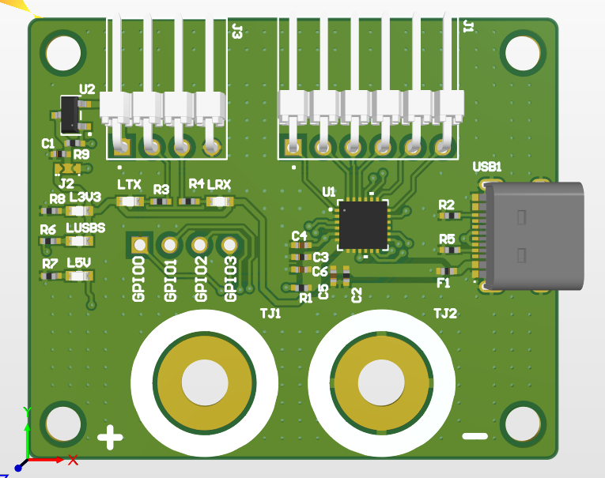

# CP210x_GPIO_x86-64
CP210x GPIO  control

# Test Results:
32 bit can support most CP210x with N variations.

64 bit can support most CP210x with N variations.

32 bit can support CH9102F with all GPIO control.

64 bit cannot support CH9102F, require official 64 bit DLL release.

# Board Example:

